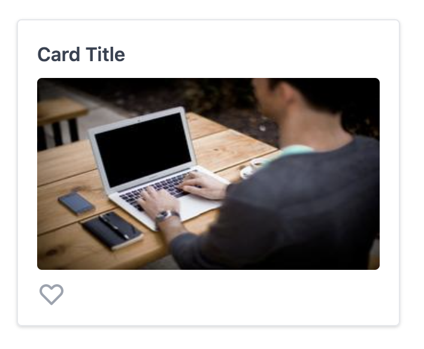

# TDD with Jest, React Testing Library, Storybook, and MockServiceWorker

Let's see if we can TDD our way through creating this card component. It displays some data from an API, and has a favorite button that can be toggled. For the purpose of this tutorial, we'll use mock data from the [JSON Placeholder Photo API](https://jsonplaceholder.typicode.com/photos) to get the card title, and [Picsum](https://picsum.photos) for some nicer images, even thought it's not strictly necessary.

This example won't include the usage of a React state management framework, but the same principals apply.

## Step 1: UI Component

Start by translating the mockup into a non-functional UI. This is a great time to introduce Storybook, which will give us the ability to quickly visualize our new component and its props.

Create `components/Card.stories.js` and `components/Card.js`. You should see this render in Storybook.

Create Primary Story, then create Favorite and LongTitle Stories.

Discussion point: are there any enzyme tests here that provide a lot of value?

I would argue no, the test cases are our Stories, and Visual Regression could be a better assertion than what we could write as a unit test.

[Step 1 Code](https://github.com/christopherslee/modern-tdd-next/compare/step1-storybook)

## Step 2: Add data fetching in a container component

We'll start by using the container pattern to add our data fetching. We'll come back to refactor this with a custom hook and show how our tests will still work!

Create `components/CardContainer.stories.js` and `components/CardContainer.js`

Use https://jsonplaceholder.typicode.com/photos/1 to fetch `title` and `url`.

Note: after this is implemented, you need to hard refresh Storybook once for MSW to take effect. Show this in the inspector. There's a quirk with Storybook's live reload that will ignore MSW.

[Step 2 Code](https://github.com/christopherslee/modern-tdd-next/compare/step1-storybook...step2-containerize-msw)

## Step 3: Write an integration test for the Card Container

Now we want to start the integration test we'll use to test interaction with the component.

Create `components/CardContainer.test.js`

We can then import the CardContainer Storybook Story into a test, along with the MSW mock.

Isn't that cool?!

[Step 3 Code](https://github.com/christopherslee/modern-tdd-next/compare/step2-containerize-msw...step3-setup-container-test)

## Step 4: Add favorite button interactivity

Now let's add interactivity to the favorite button so that clicking it will toggle it.

Add a `component/CardContainer.test.js` that clicks the favorite button, and checks the status. For this exercise, just store the button state with `React.useState`. We'll have to add a few `data-*` attributes to the icon for our RTL selectors.

It's easy to get the RTL selectors wrong, make sure to red/green your tests to ensure you are testing the right things!

You likely added a `favoriteClickHandler` prop to `components/Card.js`, and we can test that too! Create a test in `components/Card.test.js` and check that clicking the favorite button will fire the `favoriteClickHandler` prop.

[Step 4 Code](https://github.com/christopherslee/modern-tdd-next/compare/step3-setup-container-test...step4-test-favorite-button)

## Step 5: Refactor to use a custom hook

The benefit of testing the component from the outside in, and with minimal code mocking is now we can use our tests to refactor safely, and without having to change any tests!

Replace the `useEffect` hook in `components/CardContainer.js` with the hook in `components/utils/useCardData.js`. `useCardData` returns `{ isLoading, data }`, so you'll have to make a minor modification to the `CardContainer` to check the `isLoading` state before rendering the `Card`.

After refactoring, your integration tests should pass. But do you trust it?

Comment out the `setData` call in the `axios` callback in `useCardData`, and you should see your tests fail! Red/Green hooray!

[Step 5 Code](https://github.com/christopherslee/modern-tdd-next/compare/step4-test-favorite-button...step5-refactor-to-custom-hook?expand=1)

## Step 6: Use the component on your page

Now we have used Red/Green/Refactor Test Driven Development to build a component. If you didn't add it in step 4, do it now.

Replace the instructions in `pages/index.js` with your working component. Go ahead and add a few cards with different ids!

[Step 6 Code](https://github.com/christopherslee/modern-tdd-next/compare/step5-refactor-to-custom-hook...step6-use-card-on-index)