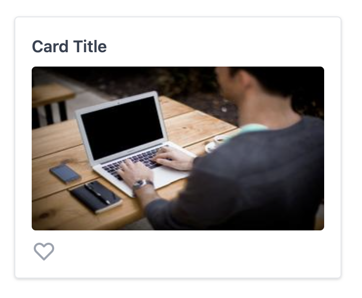

# TDD with Jest, React Testing Library, Storybook, and MockServiceWorker

Let's see if we can TDD our way through creating this card component. It displays some data from an API, and has a favorite button that can be toggled. For the purpose of this tutorial, we'll use mock data from the [JSON Placeholder Photo API](https://jsonplaceholder.typicode.com/photos) to get the card title, and [Picsum](https://picsum.photos) for some nicer images, even thought it's not strictly necessary.

This example won't include the usage of a React state management framework, but the same principals apply.

## Step 1: UI Component

Many developers would start by translating the mockup into a non-functional UI. This is a great time to introduce Storybook, which will give us the ability to quickly visualize our new component and its props.

Create `components/Card.stories.js` and `components/Card.js`. You should see this render in Storybook.

Create Primary Story, then create Favorite and LongTitle Stories.

Discussion point: are there any enzyme tests here that provide a lot of value?

I would argue no, the test cases are our Stories, and Visual Regression could be a better assertion than what we could write as a unit test.

## Step 2: Add favorite button interactivity

Create `components/Card.test.js` and import the Primary Card Story.

Write a test so that clicking button toggles favorite state.

This isn't what we really want, but we'll come back to this.

## Step 3: Fetch data from API

My understanding here is that we are often using custom hooks for this, but I'm going to use a container pattern.

Create `components/CardContainer.stories.js` and `components/CardContainer.js`

Use https://jsonplaceholder.typicode.com/photos/1 to fetch `title` and `url`.

Note: after this is implemented, you need to hard refresh Storybook once for MSW to take effect. Show this in the inspector.

Create `components/CardContainer.test.js`

## Step 4: Move the click handler to the container

Showcase Storybook action mock

When adding click handler to Card.js, don't forget to remove the state